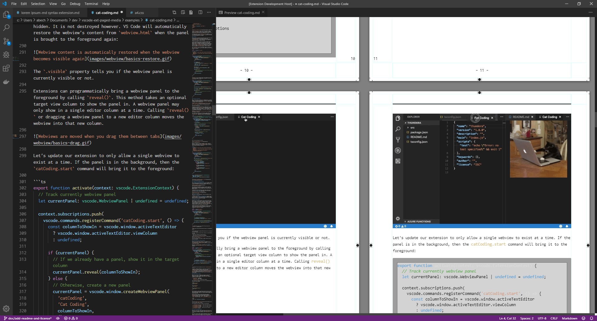
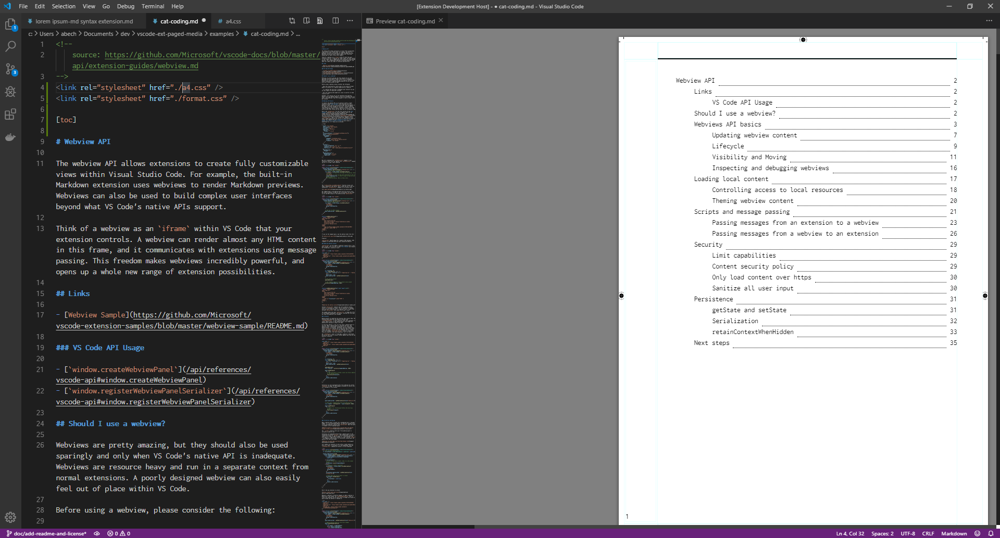
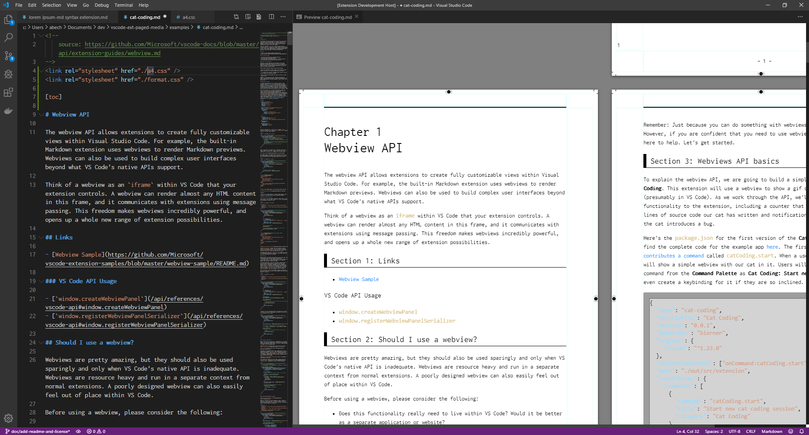
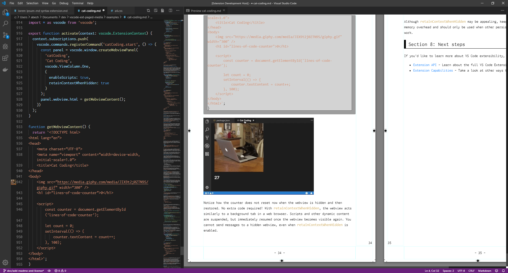
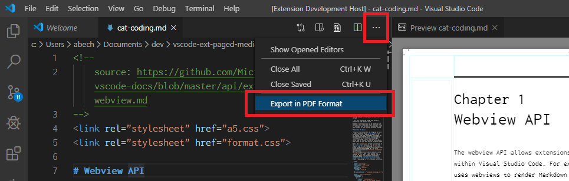
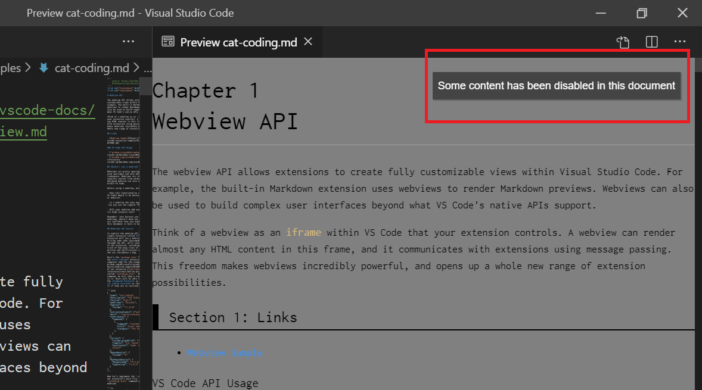
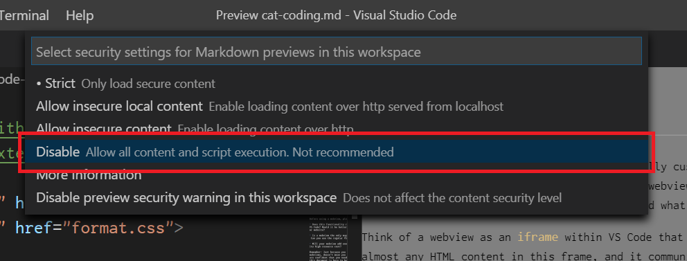

# W3C Paged Media Viewer

This is a vscode extension for writing printing books using markdown and css paged media.

Goal of this project is:

-	provide a familiar environment for writing technical books in a **modern** way

This is done by 2 lovely great projects:

-	[markdown-it](https://github.com/markdown-it/markdown-it)
	-	this is a default markdown engine in vscode which renders md file to html.
-	[Paged.js](https://www.pagedmedia.org/paged-js/)
	-	this is a css-based paged-media engine proposed by W3C which renders chunked html pages from one big continuous html.



***BE CAREFUL: SIZE OF THIS EXTENSION IS LARGE (ABOUT 200MiB), SO YOU SHOULD AVOID DOWNLOADING THIS EXTENSION VIA MOBILE NETWORK.***

## Features

-	To preview as if printed:
	-	Open a markdown file and press Ctrl+Shift+V
	-	You can specify a form factor and fancy decorations via css stylesheets as you like
	-	Available when 1) document has comment "@toppage" at its first line

	

	

	

-	To export it in PDF format:
	-	Run the command "Paged View: Export in PDF Format"
	-	Or select "Export in PDF Format" from context title menu
	-	Available when 1) document is opened in Markdown mode and 2) previewed at least once

	

## Installation

For users, you can install this extension via vscode extension marketplace.

1.	On vscode, press Ctrl+Shift+X to open "Extension" view
1.	In search box, type "paged media" and find this extension named "vscode-ext-paged-media"
1.	Then, click "install" button

## Development

For developers, you can clone code for debugging and/or developing.

-	On Windows 10 (can be done on macOS):

	1.	Clone code as below:

		```
		PS C:\***some place***> git clone git@github.com:abechanta/vscode-ext-paged-media.git
		```

	1.	Resolve dependency as below:

		```
		PS C:\***some place***> cd vscode-ext-paged-media
		PS C:\***some place***\vscode-ext-paged-media> npm intall
		```

		Git commands are required for a successful installation.

	1.	Open workspace with vscode as below:

		```
		PS C:\***some place***\vscode-ext-paged-media> code .
		```

	1.	On vscode, press Ctrl+Shift+B to build.
	1.	On vscode, press F5 for debug execution.

## Usage / Syntax

As first, vscode supports markdown spec named [CommonMark](https://spec.commonmark.org/).

As second, paged.js supports @page rule named [CSS Paged Media Module Level 3](https://gitlab.pagedmedia.org/tools/pagedjs/wikis/Support-of-specifications).

And then, this extension extends some useful syntax and features which focus on writing technical books.
You can read full specs [here](https://github.com/abechanta/vscode-ext-paged-media/wiki/Syntax).

### First Time You Preview...

When you open markdown previewer at first time, you'll encount a warning button at the top-right corner.



This is caused by Content Security Policy (CSP) mismatch between vscode's markdown previewer and this extension.
To resolve, you have to click it and change security settings of markdown previewer from "Strict" to "Disable" so that this extension works perfect.



This is by design (for now).
This extension works completely offline and won't connect any servers via http/https.

## Dependency

This extension is made from lots of graceful extensions below:

-	markdown-it-anchor
-	markdown-it-attrs
-	markdown-it-div
-	markdown-it-footnote-conventional
-	markdown-it-for-inline
-	markdown-it-include
-	markdown-it-kbd
-	markdown-it-multimd-table
-	markdown-it-ruby
-	markdown-it-toc-done-right
-	pagedjs

We thank all of them.

## License

MIT License (MIT), which you can read [here](https://github.com/abechanta/vscode-ext-paged-media/blob/master/LICENSE).
