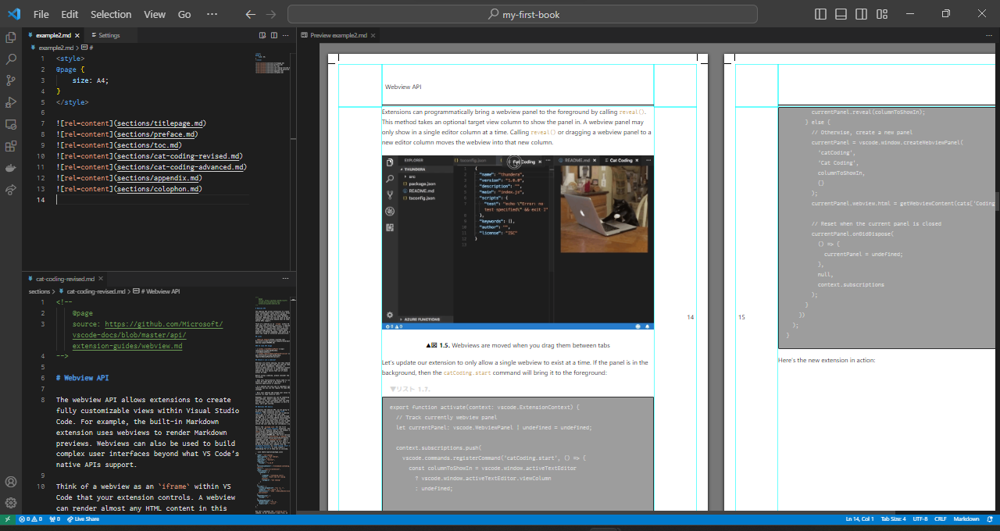
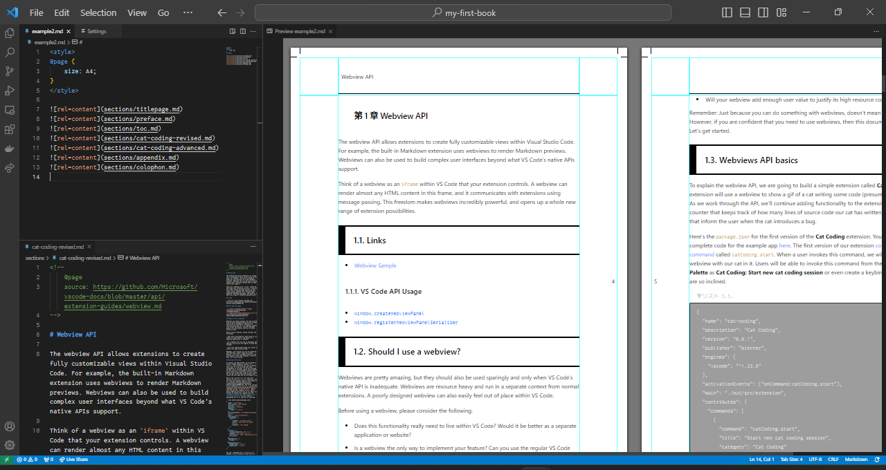

# vscode-ext-paged-media

This is a vscode extension for writing books using markdown and css paged media.

Goal of this project is:

-	provide a familiar environment for writing technical books in a **modern** way

This is done by 2 lovely great projects:

-	[markdown-it](https://github.com/markdown-it/markdown-it)
	-	this is a default markdown engine in vscode which renders md file to html.
-	[Paged.js](https://www.pagedmedia.org/paged-js/)
	-	this is a css-based paged-media engine defined by W3C which renders one big continuous html to chunked html pages.



## Features

-	Preview markdown file as if printed
	-	You can specify a form factor and fancy decorations via css stylesheets as you like
-	And export it into a PDF file (not yet, but will be covered soon)




## Install

Currently, we support only installing via git clone followed by vscode debug execution.

-	On Windows 10 (can be done on macOS), for developers:

	1.	Clone code as below:

		```
		PS C:\***some place***> git clone git@github.com:abechanta/vscode-ext-paged-media.git
		```

	1.	Exec vscode as below:

		```
		PS C:\***some place***> cd vscode-ext-paged-media
		PS C:\***some place***\vscode-ext-paged-media> code .
		```

	1.	On vscode, press F5 for debug execution.

We'll also support vscode extension marketplace for users, soon.
Stay tuned.

## Usage / Syntax

As first, vscode supports markdown spec named [CommonMark](https://spec.commonmark.org/).

As second, paged.js supports @page rule named [CSS Paged Media Module Level 3](https://gitlab.pagedmedia.org/tools/pagedjs/wikis/Support-of-specifications).

And then, this extension extends some useful syntax and features which focus on writing technical books.
<!-- You can read full specs [here](https://github.com/abechanta/vscode-ext-paged-media/blob/master/LICENSE). -->

## Dependency

This extension is made from lots of graceful extensions below:

-	markdown-it-anchor
-	markdown-it-attrs
-	markdown-it-div
-	markdown-it-footnote-conventional
-	markdown-it-for-inline
-	markdown-it-include
-	markdown-it-kbd
-	markdown-it-multimd-table
-	markdown-it-ruby
-	markdown-it-toc-done-right
-	pagedjs

We thank all of them.

## License

MIT License (MIT), which you can read [here](https://github.com/abechanta/vscode-ext-paged-media/blob/master/LICENSE).

