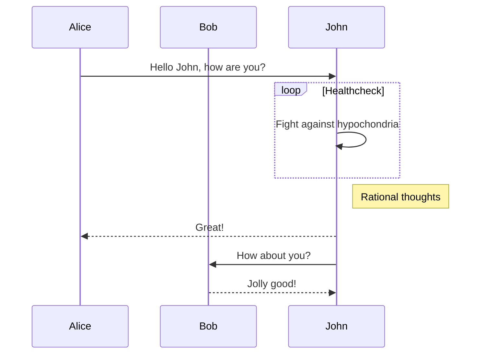

# README.md 記載のソース

```mermaid
graph TD;
    A-->B;
    A-->C;
    B-->D;
    C-->D;
```

# README.md 記載の画像より

```mermaid
sequenceDiagram
	participant Alice
	participant Bob
	Alice->>John: Hello John, how are you?
	loop Healthcheck
		John->>John: Fight against hypochondria
	end
	Note right of John: Rational thoughts
	John-->>Alice: Great!
	John->>Bob: How about you?
	Bob-->>John: Jolly good!
```
