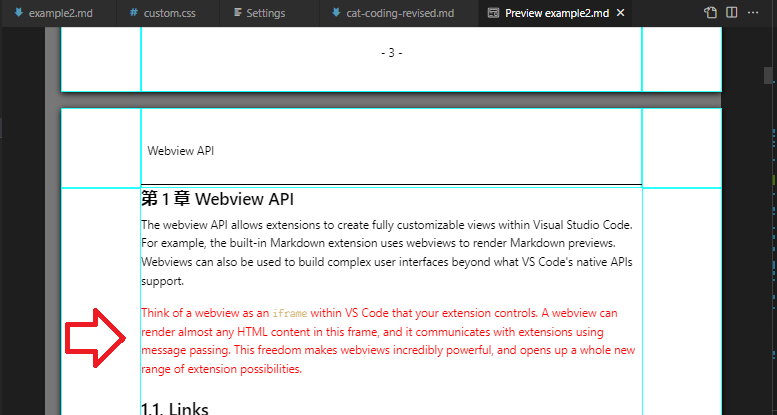

# クイックスタート

Visual Studio Code（以下「VS Code」）および Markdown Paged Media エクステンションを使って、Markdown で書いた原稿から入稿用データ（印刷用 PDF）を生成する手順について簡単に説明します。

## examples のダウンロード

[examples フォルダー](https://github.com/abechanta/vscode-ext-paged-media/tree/master/examples) からファイル一式をダウンロードして、PC 上のドキュメント置き場に展開してください。
仮にドキュメント置き場を `C:/Users/username/Documents/my-first-book/` とすると、ファイルツリーは以下のようになります。

```
C:/Users/username/Documents/my-first-book/
│  example1.md
│  example2.md
│  quickstart.md
│  syntax.md
│  
├─.vscode
│      extensions.json
│      settings.json
│
├─images
│  ├─quickstart
│  │       :
│  └─webview
│          basics-developer_tools.png
│          :
│
└─sections
       appendix.md
       :
```

## Markdown Paged Media のインストール

VS Code で `my-first-book/` を `File: Open Folder...` で開いてください。

すると VS Code が Markdown Paged Media エクステンションのインストールを勧めてくるので、`Install` ボタンを押してインストールしてください。


`my-first-book/` 直下には、原稿例となるいくつかの md ファイルがあります。
`images/` には md ファイルから参照される画像ファイルがあります。

## 印刷レイアウトでプレビューする

ではひとつ目の原稿例を見てみましょう。
ファイルエクスプローラー（ファイルツリー）から `example1.md` を選んで、中を見てみましょう。
`example1.md` の先頭には、style タグがあります。
このように Markdown には HTML タグを含められます。


ここではページサイズを A4 版に指定しています。
`example1.md` にカーソルがある状態で、コマンドパレットから `Markdown: Open Preview` を選択するか、あるいは `Ctrl + Shift + V` とタイプしてみましょう。

Markdown Preview が開きますが、コンテンツは表示されません。
このように初めてのときは VS Code（WebView）のセキュリティポリシーにより、エクステンションが正しく動作してくれません。


動作させるには、ワークスペース内とエクステンション内へのデータアクセスを許可する必要があります。
このメッセージをクリックして、表示される選択肢から `Disable` を選択してください。


Markdown Preview を開き直すと、今度は原稿がページ割り付けされた状態で表示されるはずです。


水色の線はページの輪郭と余白を示しています。
これはプレビューのときにだけ表示され、入稿用データには反映されません。

## 入稿用データをエクスポートする

`example1.md` にカーソルがある状態で、コマンドパレットから `Paged Media: Export in PDF Format` を選択するか、あるいはコンテキストタイトルメニューから `Export in PDF Format` をクリックしてみましょう。
トーストが表示されてエクスポートが始まります。

> 初めてのときは、エクスポート処理の内部で使用するブラウザーのダウンロードが発生します。
> 次の表示でしばらく待たされますが、そのまま待ってください。
> 
> 

トースト表示が赤く変化しなければ成功です。
PDF ファイルのファイル名は `example1.md.pdf`、出力先は `example1.md` があるのと同じフォルダーになります。
エクスポートされた PDF ファイルの確認には、ブラウザーの PDF ファイル閲覧機能などを利用してください。


Markdown Paged Media エクステンションの基本的な機能はこれだけです。

## 体裁の調整

書籍としての体裁や装飾を調整するには、CSS スタイルを追加指定する必要があります。
製本時によく使われる標準的なものは、プリセットスタイルとしてエクステンションに組み込まれているので、VS Code の設定エディターで使いたい機能を選択していくだけです。


ではふたつ目の原稿例を見てみましょう。
ファイルエクスプローラー（ファイルツリー）から `example2.md` を選んで、中を見てみましょう。

### ページレイアウト

まずコマンドパレットから `Preferences: Open Settings (UI)` を選択して、設定エディターを開きましょう。
`Workspace` タブを表示させ、検索フィルターに `markdown paged` を指定してから、以下のように各項目を設定してください。

- `Markdown Paged Media › Preset › Page Layout: Page Number` で `bottom-center` を選択
- `Markdown Paged Media › Preset › Page Layout: Running Header` で `top-chapters-only` を選択

Markdown Preview を開き直すと、今度は各ページがページ番号や章題（柱）で装飾された状態で表示されます。

このようなページの雛型に関する設定は、`Page Layout` というカテゴリーに分類されています。
ほかにもページサイズ、トンボ、裁ち落とし、余白幅、隠しノンブルを指定することができますので、いろいろ試してみてください。

### コンテンツレイアウト

設定エディターを開き、以下のように各項目を設定してください。

- `Markdown Paged Media › Preset › Content Layout: Page Break Chapters` で `chapters-only` を選択
- `Markdown Paged Media › Preset › Content Layout: Title Page` で `space-around` を選択
- `Markdown Paged Media › Preset › Content Layout: Colophon Page` で `bottom-on-left` を選択
- `Markdown Paged Media › Preset › Content Layout: Toc Pages` で `dotted-with-2-levels` を選択

Markdown Preview を開き直すと、今度は章が始まる前に改ページが挿入され、カバーページ（トビラ）、目次、奥付けが整形されます。

このようなページへの要素の割り付け方に関する設定は、`Content Layout` というカテゴリーに分類されています。
ほかにもキャプションまたぎ、段落またぎを指定することができます。
一部の項目は md ファイル側のマークアップを必要とするので、`example2.md` の該当する箇所を確認しながら、いろいろ試してみてください。

### コンテンツスタイル

設定エディターを開き、以下のように各項目を設定してください。

- `Markdown Paged Media › Preset › Content Style: Numbering Chapters` で `chapters-and-subchapters` を選択
- `Markdown Paged Media › Preset › Content Style: Numbering Captions` で `chapter-separated-automatd` を選択

Markdown Preview を開き直すと、今度は見出しに章番号が振られ、画像にキャプションが付くようになります。

このような要素の装飾に関する設定は、`Content Style` というカテゴリーに分類されています。
ほかにも見出し装飾、見出しサイズ、タグリンク形式を指定することができます。
一部の項目は md ファイル側のマークアップを必要とするので、`example2.md` の該当する箇所を確認しながら、いろいろ試してみてください。

### スタイルの自作

CSS3 の知識があれば、独自のスタイルを作成できます。誰かが作ったスタイルをコピペして、手元で利用することもできます。

※ ただし Markdown Paged Media エクステンションによるレンダリングプロセス、CSS Paged Media エンジンのクセなどを把握していないと、意図した表示結果にはなりません。

`my-first-book/` のフォルダーに `custom.css` という名前のファイルを作成してください。
以下の内容をコピーして、ファイルに保存してください。
これは文字色を赤くするスタイルです。

```
.red {
    color: #f00;
}
```

設定エディターを開いてから `Workspace` タブを表示させ、検索フィルターに `markdown styles` を指定してから、以下のように項目を設定してください。


`sections/cat-coding-revised.md` の 10 行目の末尾に、`{.red}` というマークアップを追加して保存してください。


`example2.md` にカーソルがある状態で Markdown Preview を開き直すと、マークアップした段落だけが赤字になります。



自作のスタイルによって、フォント、行間、段落と段落のマージン、見出しの装飾、コードブロックの装飾など、さまざまな構成要素の見栄えを調整することができます。
